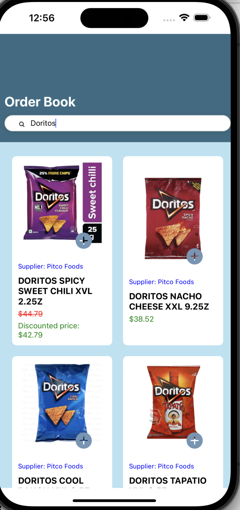
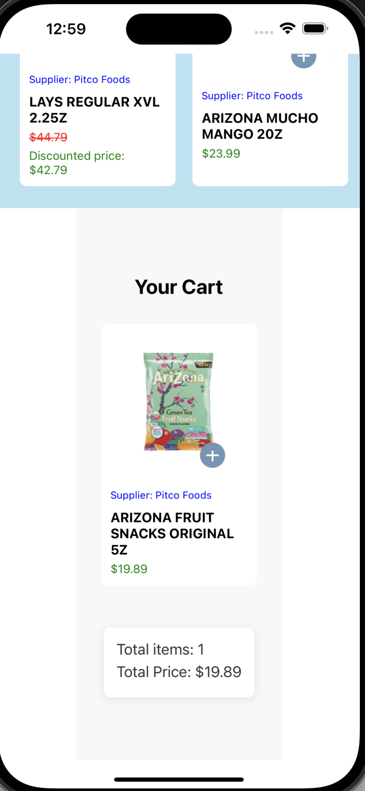

# Welcome to Zach's Attain takehome project👋

Zach's [Expo](https://expo.dev) project created with [`create-expo-app`](https://www.npmjs.com/package/create-expo-app).

Overview

This is an Inventory App that allows users to:

    View and filter items: A list of items is displayed and a search bar enables users to filter the items based on the input text.

    Add items to cart: Users can add items to their cart, which is displayed at the bottom of the screen.

    View running subtotal: The app shows the running subtotal of the items in the cart.

    View cart details: A cart view at the bottom of the screen displays the current items in the cart along with the total amount.

## Get started

1. Install dependencies

   ```bash
   npm install
   ```

2. Start the app

   ```bash
    npx expo start
   ```
3. Select option to open app with platform of choice e.g. web, iOS, Android

4. Search and add items to cart by clicking + button in product image. View your cart by scrolling to bottom of document.  


